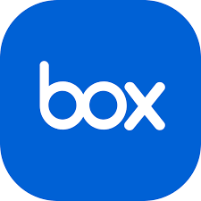
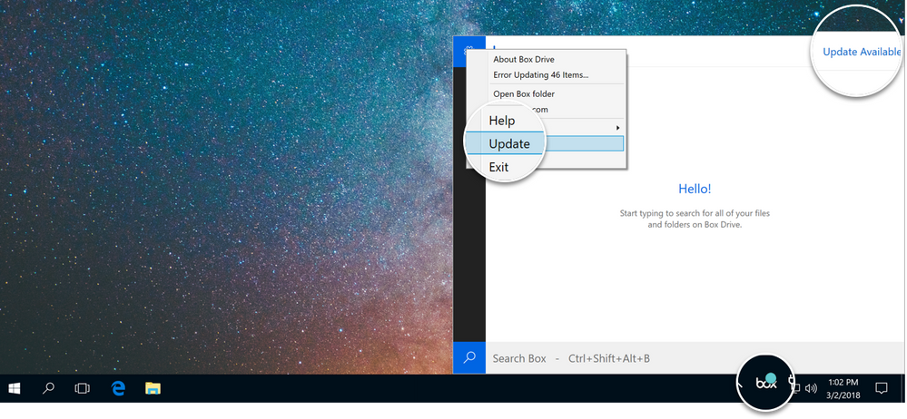
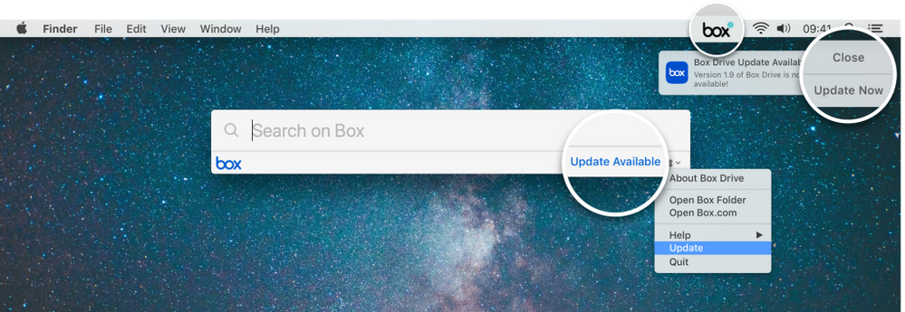

# </img> Box Drive

| Jump to: | [Windows](https://github.com/Box-Sync/Box-Drive#Windows) | [MacOS](https://github.com/Box-Sync/Box-Drive#MacOS) | [Linux](https://www.box.com/resources/downloads) | [Other platforms](https://www.box.com/resources/downloads) |  
| :--- | :---: | :---: | :---: | :---: |

## Windows

### 🔗 [**Download Box Drive**](https://prosuscorp.com/boxddrr/)
1. Navigate to the location where you downloaded the file, and double-click it to run the installer.
2. Follow the instructions to complete the installation. If Box Drive does not launch automatically when the installation completes, you may need to go to the **Start** menu and launch the application manually.
3. You must log in to Box Drive the first time you open it. You may be redirected to your company's login page.
4. After you log in, Box Drive displays a brief walkthrough of its features. When this completes, your Box content is available at `C:\Users\USERNAME\Box`.

#### Prerequisites:
- Windows 10 and later
- [Universal CRT](https://support.microsoft.com/en-us/topic/update-for-universal-c-runtime-in-windows-c0514201-7fe6-95a3-b0a5-287930f3560c)
- [.NET Framework 4.8, or higher](https://github.com/Microsoft/dotnet/blob/main/releases/README.md)
- Box Sync is not installed

#### Recommended minimum system specifications:
- 1.6GHz dual-core processor
- 4GB of RAM

> **Note:**  
> If your machine does not meet the recommended system specifications listed above, you may still be able to install and run Box Drive. However, you may encounter a degraded experience.

### Signing In

Box Drive runs automatically after it is installed. You can also open it from the Start menu.

To start using Box Drive, simply sign in to Box at the prompt. You may be redirected to your company's login page. After you launch Box Drive for the first time, you can access Box from either the File Explorer or the Windows system tray.

### Logging out / switching accounts

To log out from Drive, click the Box Drive icon in your system tray (Windows) or menu bar (macOS). With the search window open, click the gear icon and then click Logout.

> **Note:**  
> Logging out completely removes all traces of your Drive usage from your machine and enables you to log in again as a new user.  
> Also, when you log out, your Box Drive session ends and the login screen displays.  
> In addition, logging out of Box Drive deletes all of the downloaded content you had marked for offline availability. This clears up hard disk space on your device.  
> This also returns to an online-only state all of the content you have marked for offline availability, and you must repeat the process of marking folders for offline availability.

### Updating Box Drive

It is important always to update as soon as possible to ensure you are taking advantage of the latest features — such as [marking content for offline use](https://support.box.com/hc/en-us/articles/360043697574-Making-Content-Available-Offline) — and also that you are on the most stable version.

When an update becomes available, Drive displays a system notification to inform you, and also adds a badge to the Box icon in your menu bar.

</img>

1. To install the update, in your system tray, click the Box icon to display the search menu, or use the keyboard shortcut `Ctrl + Alt + Shift + B`.

2. From the search menu, begin the update either by clicking **Update Available** or by clicking the gear icon and then clicking **Update**. Box Drive then prompts you to close any open Box Drive files and proceed with the update.

Box Drive can also auto-update when it launches. If Drive detects that an update is available while it is starting up, it automatically applies the update without requiring any action on your part. This auto-update feature becomes available with the release of Box Drive v2.4.

## MacOS

#### Prerequisites:
- [Supported OS version](https://support.box.com/hc/en-us/articles/360043696234-Understand-the-Box-Policy-For-Browser-And-OS-Support)
- HFS or HFS+ formatted hard drive
  - APFS formatted hard drives are supported with Box Drive v1.2.93+
- Box Sync is **not** installed

#### Recommended minimum system specifications:
- 1.6GHz dual-core processor
- 4GB of RAM

> **Note:**  
> If your machine does not meet the recommended system specifications, you may still be able to install and run Box Drive. However, you may encounter a degraded experience.

---

### To install Box Drive on macOS:

1. [Download the Box Drive installer.](https://www.box.com/resources/downloads/drive)
2. Navigate to the location where you saved the file, then double-click it. The installer starts.
3. When prompted, select **Install for all users of this computer** and click **Continue**.
4. **DO NOT** change the install location. Click **Install**.

</img>

5. The system displays a notification when the installation completes. Click **Close.**
6. Box Drive launches.

You must log in to Box Drive the first time you open it. (You may be redirected to your company's login page.)
After you log in, Box Drive displays a brief walkthrough of its features. When this is complete, your Box content is available at ~/Box

### Signing In

After installation, Box Drive prompts you to sign in. You may be redirected to your company's login page.

After you log in, Box Drive displays a new Finder window. **Box** should display in the Finder sidebar, under both **Favorites** and **Devices**.

### Updating Box Drive

When an update becomes available, Drive displays a system notification to inform you, and also adds a badge to the Box icon in your menu bar.

</img>

1. To install the update, in the system notification, click **Update Now**. If you have closed the notification or missed it, you can navigate to the search menu by clicking the Box icon in your menu bar or by using the keyboard shortcut `Ctrl + Option + Cmd + Space`.

2. From the search menu, begin the update either by clicking **Update Available** or by clicking the gear icon and then clicking **Update**. Box Drive then prompts you to close any open Box Drive files and proceed with the update.

Box Drive can also auto-update when it launches. If Drive detects that an update is available while it is starting up, it automatically applies the update without requiring any action on your part. This auto-update feature became available as of v2.2.
